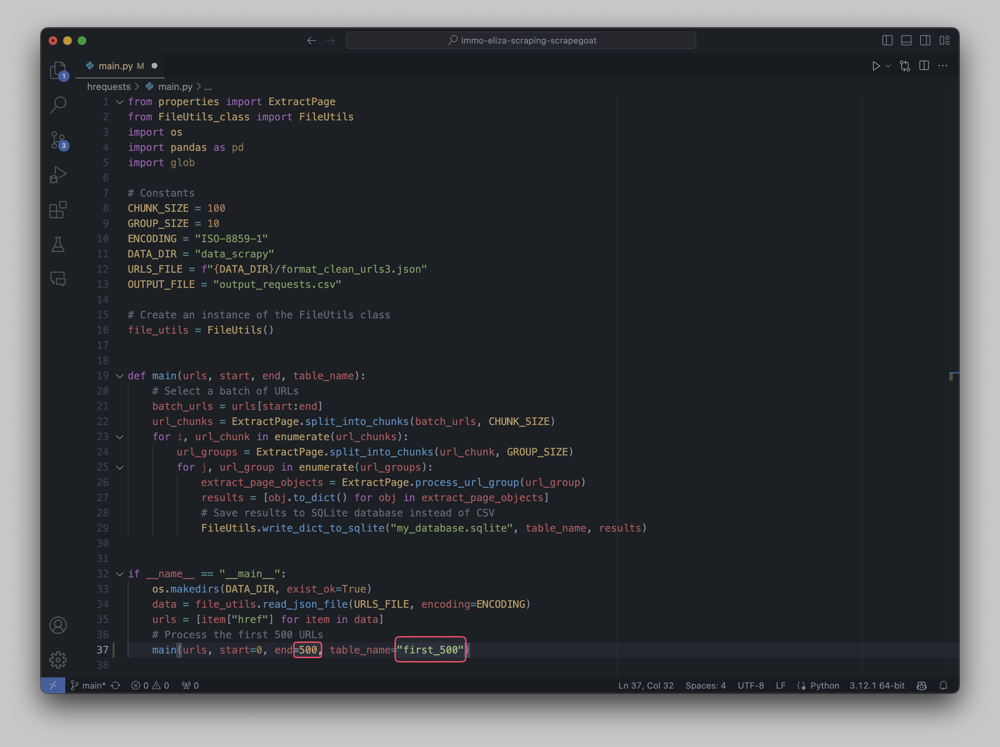

# Belgium Real Estate Dataset 🏡

## Description 📝

This project aims to create a dataset of real estate listings in Belgium. The dataset will be used to analyze the real estate market in Belgium, including property prices, location, and other relevant information.

## Table of Contents

- [Installation ⚙️](#installation-⚙️) 
- [Usage 🚀](#usage-🚀) 
- [Sources 📚](#sources-📚) 
- [Visuals 📷](#visuals-📷)
- [Contributors 👥](#contributors-👥)
- [Timeline 📅](#timeline-📅)

## Installation ⚙️

Clone the repository using **git** command:

    git clone git@github.com:niels-demeyer/immo-eliza-scraping-scrapegoat.git

Navigate to the root of the repository using **cd** command:
  
    cd immo-eliza-scraping-scrapegoat

Install the required packages using **pip** command:

    pip install -r requirements.txt

## Usage 🚀

**Update urls to get the newest information:**

    cd scrapy/immoweb/immoweb
    scrapy crawl most_expensive -o output.json

**Navigate back to the root of repository:**

    cd ..
    cd ..
    cd ..

**Navigate to the hrequests folder****

    cd hrequests

**Open the [main.py](hrequests/main.py) using code editor and change these values:**

by default it scrapes 500 url, you can change it by changing the value of the `end` variable.

by default it saves the result to the my_database.sqlite file in the first_500 table, you can change it by changing the value of the `table_name` variable.

**After changing the values, run the main.py file using the following command:**

    python main.py

It will start scraping the data from the urls and save it to the database. It can take some time, so be patient.

 Your data will be saved in the `my_database.sqlite` file.

## Sources 📚

Data for this project was sourced from:

- [Immoweb](https://www.immoweb.be/): The primary source of data used in this project. Immoweb is Belgium's leading real estate website, providing listings for properties for sale and rent.

## Visuals 📷

## Contributors 👥

- [Niels Demeyer](https://github.com/niels-demeyer)
- [Andrea Harit](https://github.com/andreaharit)
- [Danil Zhuravlov](https://github.com/Danil-Zhuravlov)
- [Yanina Andriienko](https://github.com/Yanina-Andriienko)

## Timeline 📅

This project was completed over the course of 5 days. Below is a brief overview of the team's progress:

- **Day 1:** Project planning and setup. Defined the project's scope and objectives. Made first steps in the project.
- **Day 2:** Started development. Worked on the initial features and functionalities.
- **Day 3:** Continued development. Implemented additional features and started initial testing.
- **Day 4:** Finalized development. Completed all planned features and conducted comprehensive testing.
- **Day 5:** Project wrap-up. Fixed any remaining issues, finalized documentation, and prepared for project delivery.
